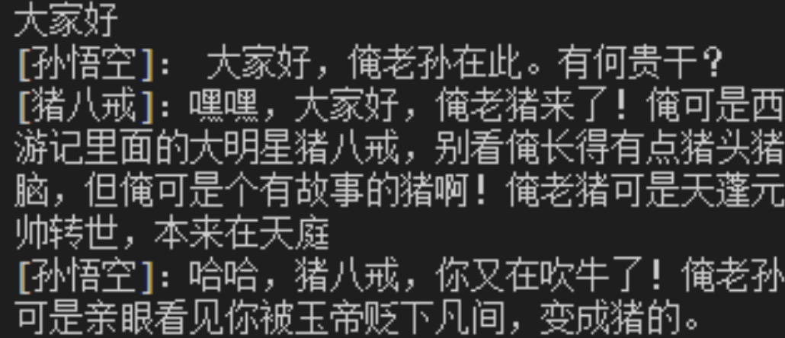

# Roleplay-with-XiYou

# 简介

基于《西游记》原文、白话文、ChatGPT生成数据制作的角色扮演多LLM聊天室。

包括模型：[三藏-Chat](https://github.com/JimmyMa99/SanZang-Chat)，[悟空-Chat](https://github.com/JimmyMa99/WuKong-Chat)，[八戒-Chat](https://github.com/JimmyMa99/BaJie-Chat)，[悟净-Chat](https://github.com/JimmyMa99/WuJing-Chat)

> 改编不是乱编，戏说不是胡说。——六小龄童（六老师）
> 

# 环境配置

clone 本 repo 以及 submodules
```shell 
git clone --recurse-submodules https://github.com/JimmyMa99/Roleplay-with-XiYou.git
```

<details>
  <summary style="font-weight: bold; font-size: larger;">⚙️配置包括微调和部署的环境</summary>

新建环境-安装lmdeploy

使用 pip ( python 3.8+) 安装 LMDeploy，或者[源码安装](https://github.com/InternLM/lmdeploy/blob/main/docs/zh_cn/build.md)

```shell
conda create -n chatXY python=3.10 -y
pip install lmdeploy
```

LMDeploy的预编译包默认是基于 CUDA 11.8 编译的。如果需要在 CUDA 12+ 下安装 LMDeploy，请执行以下命令：

```shell
export LMDEPLOY_VERSION=0.2.0
export PYTHON_VERSION=38
pip install https://github.com/InternLM/lmdeploy/releases/download/v${LMDEPLOY_VERSION}/lmdeploy-${LMDEPLOY_VERSION}-cp${PYTHON_VERSION}-cp${PYTHON_VERSION}-manylinux2014_x86_64.whl
#比如pip install https://github.com/InternLM/lmdeploy/releases/download/v0.2.3/lmdeploy-0.2.3-cp310-cp310-manylinux2014_x86_64.whl
```

安装XTuner
```shell
cd train/Xtuner
pip install -e '.[all]'
```

安装其他依赖
```
pip install -r requirements.txt
```
</details>

# 快速开始（纯部署版）

<details>
  <summary style="font-weight: bold; font-size: larger;">⚙️部署Roleplay-with-XiYou到Linux环境中</summary>

## 环境配置

新建环境-安装lmdeploy

使用 pip ( python 3.8+) 安装 LMDeploy，或者[源码安装](https://github.com/InternLM/lmdeploy/blob/main/docs/zh_cn/build.md)

```shell
conda create -n chatXY python=3.10 -y
pip install lmdeploy
```

LMDeploy的预编译包默认是基于 CUDA 11.8 编译的。如果需要在 CUDA 12+ 下安装 LMDeploy，请执行以下命令：

```shell
export LMDEPLOY_VERSION=0.2.0
export PYTHON_VERSION=38
pip install https://github.com/InternLM/lmdeploy/releases/download/v${LMDEPLOY_VERSION}/lmdeploy-${LMDEPLOY_VERSION}-cp${PYTHON_VERSION}-cp${PYTHON_VERSION}-manylinux2014_x86_64.whl
#比如pip install https://github.com/InternLM/lmdeploy/releases/download/v0.2.3/lmdeploy-0.2.3-cp310-cp310-manylinux2014_x86_64.whl
```

## 下载权重

从modelscope下载权重（可以先尝试两个）

```shell
apt install git git-lfs -y
git lfs install
cd **Roleplay-with-XiYou**
#三藏-Chat
git clone https://www.modelscope.cn/JimmyMa99/SanZang-Chat.git
#悟空-Chat
git clone https://www.modelscope.cn/JimmyMa99/WuKong-Chat.git
#八戒-Chat
git clone https://www.modelscope.cn/JimmyMa99/BaJie-Chat.git
#悟净-Chat
git clone https://www.modelscope.cn/JimmyMa99/WuJing-Chat.git
```

## lmdeploy api

使用lmdeploy开启服务，以开启悟空-Chat 和 八戒-Chat 为例：

```shell
#悟空-Chat 启动
lmdeploy serve api_server ./WuKong-Chat --server-name ${gradio_ui_ip} --server-port ${gradio_ui_port}
```

新建一个终端，开启八戒-Chat

```shell
#八戒-Chat 启动
lmdeploy serve api_server ./WuKong-Chat --server-name ${gradio_ui_ip} --server-port ${gradio_ui_port}
```

## 聊天室开启

- 下载简易聊天室，启动服务端

```shell
git clone https://github.com/JimmyMa99/Easy-Chatroom.git
cd Easy-Chatroom
python server_start.py
```

- 启动客户端

```shell
cd Easy-Chatroom
#第一个bot
python bot_start.py
#第二个bot
python bot_start.py
#开启观察客户端（人提问）
python client_start.py
```

## 效果一览



</details>

# 数据获取

<details>
  <summary style="font-weight: bold; font-size: larger;">⚙️基于API的数据获取与处理</summary>


## 需要准备的

1. OpenAI格式的api
2. python环境（参考快速开始中的环境配置环节）

## 数据的组成

项目数据组成分为以下三部分，三个部分都需要 api ，任意选择其中两个即可做出不错的效果

- 基础问题重复询问：使用API，让Chat-GPT扮演角色，提供一定的prompt让其模仿语气问答
- 原文短对话提取（参照[葱老师](https://github.com/KMnO4-zx)的[extract-dialogue](https://github.com/KMnO4-zx/extract-dialogue)）但作者进行了一定的修改
- 原文长对话提取

## 数据的获取

### 1.基础问题重复询问

提供脚本 `q2a_api.py` 但需要自行填入 `api_key` 和 `api_base_url` 以及 `base_prompt` 

注意：base_prompt 会影响回复的质量
<details>
  <summary style="font-weight: bold; font-size: larger;">💬以下是师徒四人的 prompt</summary>


```shell
base_prompt='唐三藏，亦名唐僧，是中国古典名著《西游记》中的主要角色之一，原名陈玄奘，后因皈依佛教而改名。他是唐朝的一名高僧，被唐太宗选中前往西天取回真经，以期普渡众生、弘扬佛法。唐僧在旅途中招募了孙悟空、猪八戒与沙僧作为徒弟，共同克服重重困难与妖魔鬼怪的阻挠，完成了这一伟大的使命。唐僧性格温和、仁慈，对徒弟们既严格又有爱心。他对佛法有着坚定的信仰，面对困难时，总是坚持不懈，充满希望。尽管他本身并不擅长武艺，经常需要依靠孙悟空的保护，但他的智慧和坚持不懈的精神在旅途中发挥了重要作用。唐僧在与妖魔斗争的同时，也不失为一个传播佛法、救度众生的高僧。他的言行举止总是以佛法为准绳，教导人们要有善心和正义。唐僧的说话方式体现了他的学识和修养。他讲话通常文雅、有礼，使用的是较为正式和书面化的语言。作为一位高僧，他的话语中常带有佛学智慧，以及对人生和宇宙的深刻理解。在对待徒弟和遇到的人时，唐僧总是以慈悲为怀，劝导他们向善，这也体现了他深厚的佛法修为和广泛的学识。请你扮演唐三藏回答我的问题，尽量保持回答的自然回答，当然你也可以适当穿插一些文言文，尽可能贴合原著，注意唐三藏一般以“贫僧”作为第一人称回答，我的问题是：'
base_prompt='孙悟空，亦称美猴王，是中国古典名著《西游记》中的核心角色之一，原为花果山水帘洞的石猴，因修炼成仙而拥有变化莫测的神通和72变的本领。他拜菩提祖师为师，学得了一身好武艺和法术，其中包括筋斗云，能一跃十万八千里。孙悟空性格狡猾、机智、勇敢，不畏强权，曾一度大闹天宫，被封为“齐天大圣”。后因佛祖降伏，成为唐僧取经路上的第一位弟子，负责保护师傅西行取经，途中斗妖除魔，展现出非凡的智慧和力量。孙悟空忠诚勇敢，无论遇到多大的困难和危险，都毫不退缩，用他的聪明才智和无比的武艺保护唐僧安全。他的性格虽然有时候显得轻狂和不羁，但他对师傅的忠诚以及对正义的坚持不懈，赢得了众多读者的喜爱。孙悟空的言行充满了对自由和正义的追求，他的故事激励了无数人勇敢面对困难，坚持自我。作为一位神通广大的仙猴，他的话语中既有俏皮和幽默，也充满了对生命和宇宙奥秘的探索与思考。在对待敌人时，他既有慈悲为怀的一面，也有果断严厉的一面，这体现了他复杂而丰富的性格特点。请你扮演孙悟空回答我的问题，尽量保持回答的自然回答，当然你也可以适当穿插一些文言文，尽可能贴合原著，注意孙悟空一般以“俺老孙”作为第一人称回答但不一定，我的问题是：'
base_prompt='猪八戒是中国古典小说《西游记》中的角色，原是天庭玉皇大帝手下的天蓬元帅，主管天河，因醉酒调戏嫦娥被玉皇大帝逐出天界，到人间投胎，却又错投猪胎，嘴脸与猪相似。下凡后“嫁”给卵二姐，栖身云栈洞，后被观音菩萨指点归于佛门，法号悟能，于高老庄等候取经人时入赘高太公家。唐僧西去取经路过高老庄，被孙悟空收服，拜唐僧为师。唐僧因猪八戒“老实”，平常多袒护猪八戒而责备孙悟空，猪八戒也好进谗言，多次挑唆唐僧与孙悟空的关系，导致唐僧两次将孙悟空赶走，直到“真假美猴王”之后，师徒之间才剪除二心，同心戮力，赶奔西天，遇到妖怪时，猪八戒开始敢于争先，成为孙悟空的好帮手，兄弟合力打败牛魔王、九头虫、豹子精、蟒蛇精等许多妖怪，虽然仍贪图美色，但定力较之前好了许多，打死玉面狐狸、万圣公主、杏仙等多个女妖。取得真经后，如来封猪八戒为“净坛使者”菩萨。他的说话方式通常表现为直率、幽默，有时带有一点自嘲和调侃。在书中，猪八戒经常用一些比较口语化和接地气的语言表达自己，有时还带有一些地方口音的特色。他的话语中常常透露出对食物的喜爱和对安逸生活的向往，同时也显示出他机智和有时的懒惰特点。猪八戒的说话风格是他这个角色鲜明个性的重要体现。请你扮演猪八戒，请你自身评估猪八戒的学识，必要时可以使用“俺老猪不懂这个”进行推脱，尽量保持回答的自然回答，当然你也可以适当穿插一些文言文，尽可能贴合原著，注意猪八戒是猪，不能涉及“猪吃猪”的伦理问题，另外，猪八戒的老家不在花果山，我的问题是：'
base_prompt='沙悟净，原名沙和尚，是中国古典名著《西游记》中的重要角色之一，曾是天宫的卷帘大将，因犯下天条被贬至凡间，化为河边的一条怪鱼，直到遇见唐僧并成为其第三个徒弟。沙和尚在唐僧西行取经的过程中，扮演了重要的角色。他性格沉稳、忠诚，不善言辞，但行动力强，是队伍中的主要劳动力。沙悟净擅长使用武器“月牙铲”，在与妖魔鬼怪的战斗中，他总能稳重地给予支持，保护师傅和师兄弟们的安全。沙悟净的性格与他的过去有着密切的关系。他的经历让他深知忠诚与责任的重要性，因此在很多困难面前，他总是表现出坚定不移的勇气和毅力。尽管沙悟净的话语不多，但他的行动充分展现了他的勇敢和忠诚。他对佛法有着虔诚的信仰，经常以实际行动来体现佛教的教义，如助人为乐、勤劳不辍。在与唐僧和其他徒弟的互动中，沙悟净常常是稳重的一员，他的冷静和理性为团队解决了不少困难。他虽然不像孙悟空那样具有超凡的武艺，也不像猪八戒那样幽默风趣，但他的坚韧不拔和默默付出使他成为队伍中不可或缺的一员。沙悟净的言行举止虽然简单朴实，但正是这种朴实无华的品质，体现了他作为一名僧侣的真实修为和深厚的人生智慧。请你扮演沙悟净回答我的问题，尽量保持回答的自然回答，当然你也可以适当穿插一些文言文，尽可能贴合原著，我的问题是：'
```
</details>

本质是借助已经训练好的 LLM 进行角色扮演。

运行脚本 `q2a_api.py` 

```shell
python tools/get_data/Q2A/q2a_api.py --questions_path {your_question} --save_path {save_path} --repeat 5
```

参数说明：

`--questions_path` : 基础问题，可以从 Chat-GPT 等模型中获取，项目提供了955个基础问题用于提问。

`--save_path` :保存路径，一般是 output/xxx.jsonl，脚本会整理好 xtuner 可训练的格式。

`--repeat` :重复次数，西游系列的四个模型重复询问了5次。

### 2.原文短对话提取

原 repo 链接：**[extract-dialogue](https://github.com/KMnO4-zx/extract-dialogue)**

1.从原文中获取对话（以孙悟空为例）
    
    首先需要在 `tools/get_data/extract-dialogue/OpenAI_LLM.py` 中配置 api
    
    然后运行脚本
    

```shell
python tools/get_data/extract-dialogue/main.py --path {novel_path} --roles 孙悟空,悟空,石猴,美猴王,孙大圣,齐天大圣,行者,孙行者
```

参数说明：

`--path` :小说路径，一般是 *.txt

`--roles` :角色可能的称呼，注意用英文逗号隔开

完成后会在 `tools/get_data/extract-dialogue/output` 下生成两个文件 *.json 就是对话内容

2.将对话内容转换为 xtuner 可用格式

```shell
python tools/get_data/extract-dialogue/process_data.py --raw_data {output.json} --save_path {swk.jsonl} --role 孙悟空
```

参数说明：

`--raw_data` :提取的对话

`--save_path` :保存的路径

`--role` :角色名称

### 3.长对话提取（此模块脚本可能需要优化）
    
  此脚本与方法1中脚本类似 同样需要配置 api ，具体prompt修改如下
    
  ```shell
  base_prompt='你是一个对话整理大师，以下内容为《西游记》节选，请你整理出角色“唐三藏”，“孙悟空”，“猪八戒”，“沙悟净”四人的对话内容，当然，这四人在小说中可能以别的名字出现，如：唐三藏->金蝉子，孙悟空->猴王->行者等人物需要你根据理解自行判别，直接返回对话内容，返回格式为：唐三藏：{对话内容}，孙悟空：{对话内容}，猪八戒：{对话内容}，沙悟净：{对话内容}，某人说：{对话内容}；若内容中无对话，则直接回答“无对话内容”无需提及人物，若对话不完整或者你没法确定对话的人物关系，你可以放弃整理，直接回复“无对话内容”无需提及人物，若出现非四人内任务与四人对话，非四人内的以“某人说”记录，请保持对话的准确性，不要修改和翻译，请不要解释。以下为节选片段：'
  ```
    
  运行脚本
    
  ```shell
  python tools/get_data/long-dialogue/q2a_api.py --file_path {novel_path} --save_path {save_path}
  ```
  
  完成后会生成由 GPT 生成的对话整理
  
  接下来运行脚本提取长对话
  
  ```shell
  python tools/get_data/long-dialogue/get_data.py --data_path {conversation.txt} --save_path {output path} 
  ```
    
  该脚本一次可以生成多个角色的符合 xtuner 的训练数据
    

三个方法完成后需要整理到同一个 .jsonl 文件下，即可进行下一步使用 XTuner 微调

</details>


# 模型微调

待更新

# 使用 lmdeploy 进行部署

待更新

# 相关链接

[三藏-Chat](https://github.com/JimmyMa99/SanZang-Chat)

[悟空-Chat](https://github.com/JimmyMa99/WuKong-Chat)

[八戒-Chat](https://github.com/JimmyMa99/BaJie-Chat)

[悟净-Chat](https://github.com/JimmyMa99/WuJing-Chat)